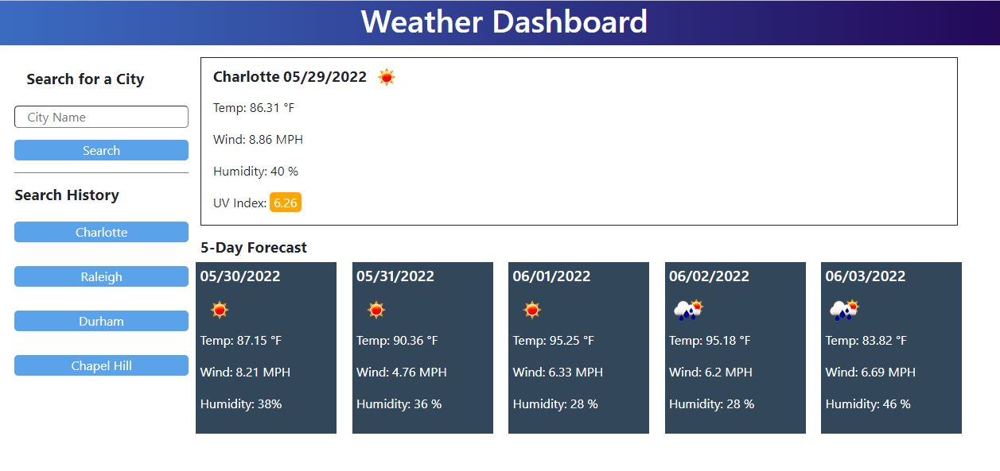

# weather-dashboard
## Description
This website displays weather information about a city that the user searches for. It saves that city to local storage and creates a button, so that when user clicks on that button, data about that city is dynamically generated. Data displayed includes current weather conditions and conditions for the next five days. This website uses opneweather API, moment.js for the dates, Bootstrap, and jQuery.

## Screenshot

## GitHub Repository Link
https://github.com/jorge30fm/weather-dashboard
## Application link
 https://jorge30fm.github.io/weather-dashboard/